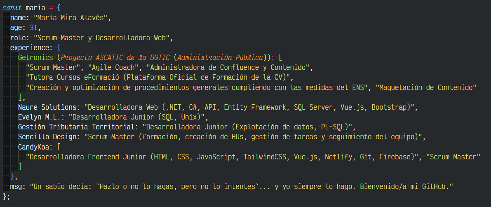

<h1 align="center"> ¡Hola! Soy María Mira 👩🏻‍💻👋🏻 </h1>

 💻✨Desarrolladora Web & Scrum Master✨💻

<h3 align="left">Herramientas... ✔🛠</h3>

 

▫ Lenguajes de programación:    

▫ Frameworks:     
 

▫ Base de datos:   

▫ Diseño:   

▫ Otros:     

<h3 align="left">Proyectos... 🗂</h3>

<a href="https://store.candykoa.es" target="blank">▫ 🍭 CandyKoa - Tienda de dulces internacionales online 🍭</a> - Herramientas utilizadas: VueJS, Pinia y TailwindCSS

<h3 align="left">Actualmente busco... 🔍📚</h3>

▫ Proyectos nuevos en los que seguir creciendo como profesional y que me permitan mejorar mis conocimientos 📈

▫ Aprender otros Frameworks como React  y Angular 

▫ Seguir creciendo en BackEnd, desarrollando APIs y ampliando mis conocimientos aprendiendo Java .

<h3 align="left">Si quieres saber más sobre mi... 🧐</h3>
 

 

